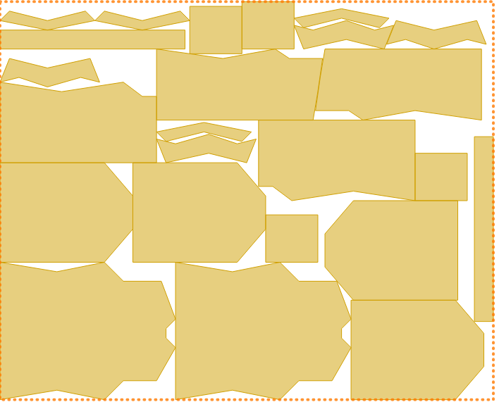
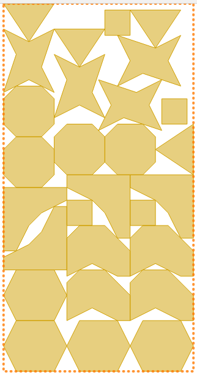

# 2D Irregular Cutting Stock Algorithm &middot;   

## Table of Contents
1. [ Description ](#description)
2. [ Installation ](#installation)
3. [ Build ](#build)
4. [ Algorithm ](#algorithm)
5. [Result](#result)
6. [ Credits ](#credits)
7. [ License ](#license)
8. [ Conclusion ](#conclusion) 


<a name="description"></a>
## Description
In operations research, the cutting-stock problem is the problem of cutting standard-sized pieces of stock material, such as paper rolls or sheet metal, into pieces of specified sizes while minimizing material wasted. It is an optimization problem in mathematics that arises from applications in industry. In terms of computational complexity, the problem is an NP-hard problem reducible to the knapsack problem. The problem can be formulated as an integer linear programming problem.<br><br>
**Applications**
* Stock cutting in textile industry
* Glass cutting in glass industry
* Paper sheets cutting in paper industry
---
<a name="installation"></a>
## Installation
* Install C compiler GNU version 7.3.0 <br>
* Install sublime text 3
* Install  if not installed.
---
<a name="build"></a>
## Build 
* Open terminal
* Clone the repository by the following command <br>
  > `git clone [repository url]` <br>
* Open **sublime text 3** and open project folder **2D-Irregular-Stock-Cutting-Algorithm** <br>
* To  build run the following commands <br>
  > `$ mkdir build` <br>
    `$ cd build` <br>
    `$ cmake ..`<br>
    `$ make`<br>
* In order to run the tests
  > `$ make test`
* An executable file **(run)** will be created.
* Run command `$ ./run` to execute the program.
---
<a name="algorithm"></a>
## Algorithm &middot;  <br>
```
1 function merge(Item A, Item B):
2     
3     edge PQ = findLargestEdge(A)
4     edge RS = findLargestEdge(B)
5     
6     Item C_at_PR = place item B's point R at item A's point P
7     Item C_at_PS = place item B's point S at item A's point P
8     Item C_at_QR = place item B's point R at item A's point Q
10    Item C_at_QS = place item B's point S at item A's point Q
11.
12.   return best of C_at_PR, C_at_PS, C_at_QR, C_at_QS
```
```
1. function split(vector<Item> items, int left, int right):
2.     if left == right then return items[ left ]
3.     mid = (left + right) / 2
4.     Item A = split(items, left, mid)
5.     Item B = split(items, mid + 1, right)
6      Item C
7.     for r1 in rotations:
8.         D = rotate A in r1 degree
9.         for r2 in rotations:
10.            E = rotate B in r2 degree
11.            F = merge(D, E)
12.            if F is better than C, then C = F 
13.    return C
```
<a name="result"></a>
## Result



<a name="credits"></a>
## Credits 

<table style="width:100%">
  <tr>
    <td> 
      <b>Ahmed Fardin</b> <br>
      Head of Sustainability<br>
      Decorte Future Industries<br>
      Cambridge, United Kingdom 
    </td>
    <td> 
      <b>Masum Bhuiyan</b> <br>
      B. Sc. in Computer Science <br>
      Jahangirnagar University <br>
      Dhaka, Bangladesh
    </td>
    <td> 
      <b>Kamrul Hasan</b> <br>
      B. Sc. in Computer Science <br>
      Jahangirnagar University <br>
      Dhaka, Bangladesh
    </td>
  </tr>
</table>

<a name="license"></a>
## Lincense  <br>
MIT License

Permission is hereby granted, free of charge, to any person obtaining a copy
of this software and associated documentation files (the "Software"), to deal
in the Software without restriction, including without limitation the rights
to use, copy, modify, merge, publish, distribute, sublicense, and/or sell
copies of the Software, and to permit persons to whom the Software is
furnished to do so, subject to the following conditions:

The above copyright notice and this permission notice shall be included in all
copies or substantial portions of the Software.
<a name="conclusion"></a>
## Conclusion
Checkout the [wiki](https://www.demo.com) for detail description of the project.
